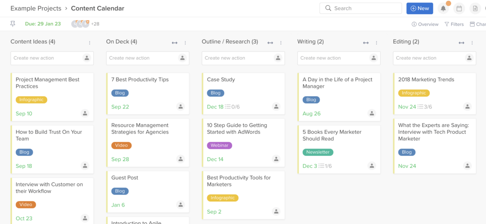
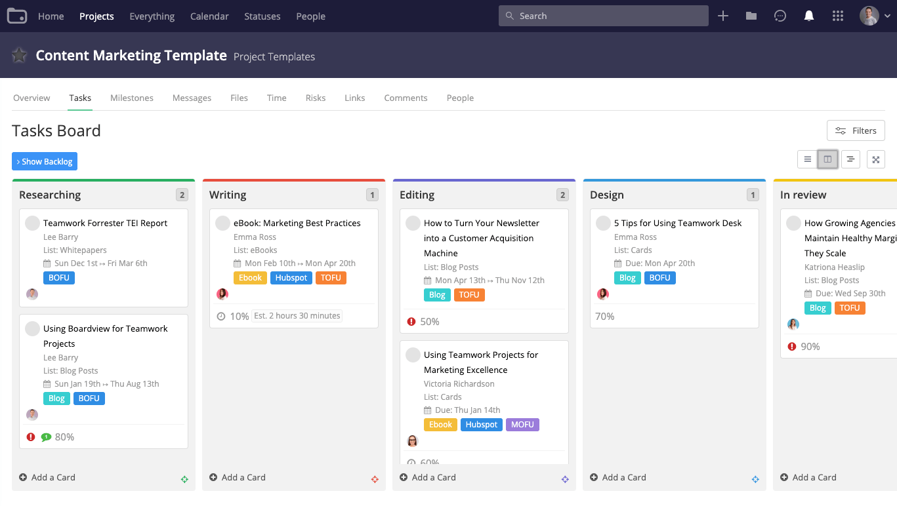
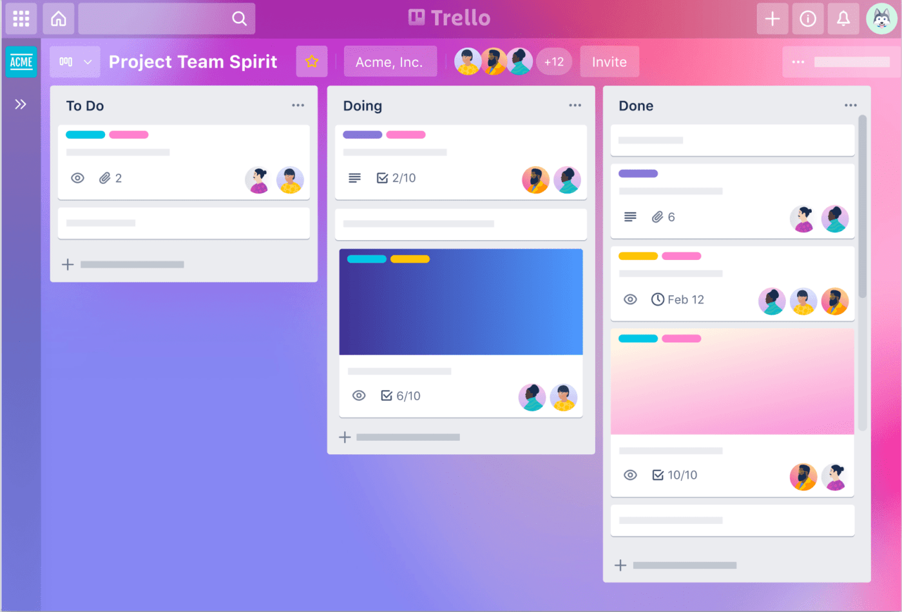
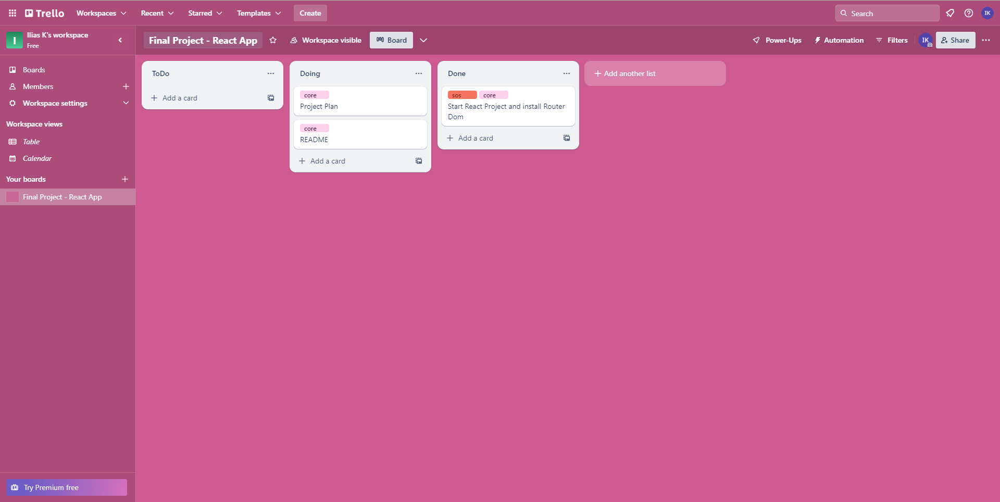

# Final Project (Oct. 12 - Oct 31)
This is going to serve as a planning reference for my project. I am planning to work on a **Project
Management Tool**. I am going to build a Spring Boot Application that will implement an API which will get data from a mySQL Local Server and provide them to my React App to display.

## Core Functionality > Front-end: React App
I am going to focus first on building some core aspects of the project and if these are done and 
there is still time left, then I will move on into extending this functionality. My first focus is
to be able to have a user create a workspace where he can organise the progress of his project using task lists and tasks.

### Front-End
The primary focus will be to develop a user interface that will resemble the looks and some of the
core functionality of a tool like Hive.
   
 
  
Alternatively some of the UI or functionality can also resemble a tool like Teamwork.
  

  
If there is plenty of time the desired end-goal could be something that resembles a tool like Trello.
  

### Plan with Trello
I am going to use Trello to manage the progress of my project. This way I can be more organised about the planning process and at the same time experiment live with a tool similar to what I am developing.
  
Example:

### Styling Guide
The design of the page is going to use the following colour pallete:
- Whitesmoke: #F5F5F5
- Pastel Blue: #A7C7E7
- Steel Blue: #4682B4
- Sapphire: #0F52BA
